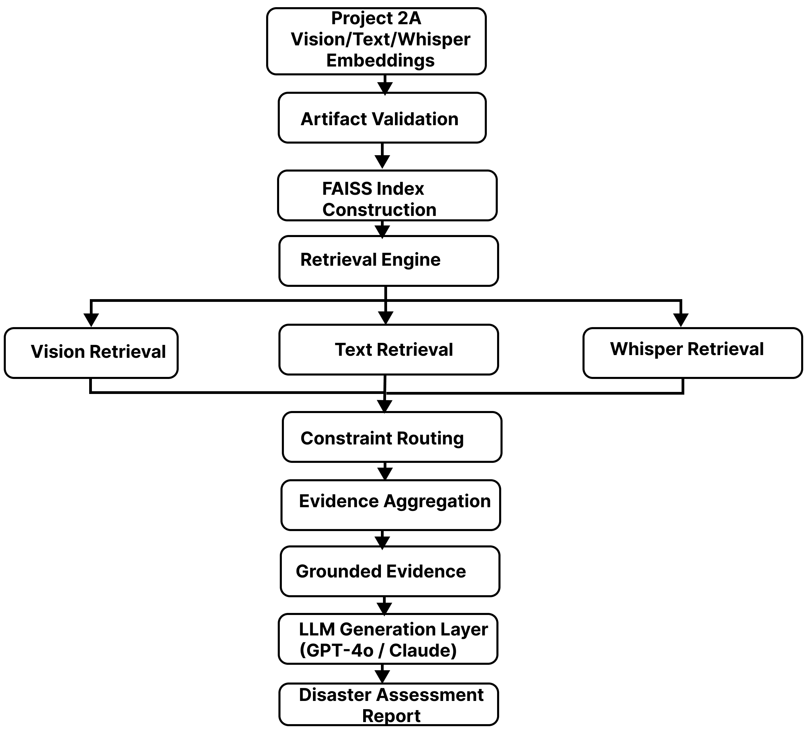
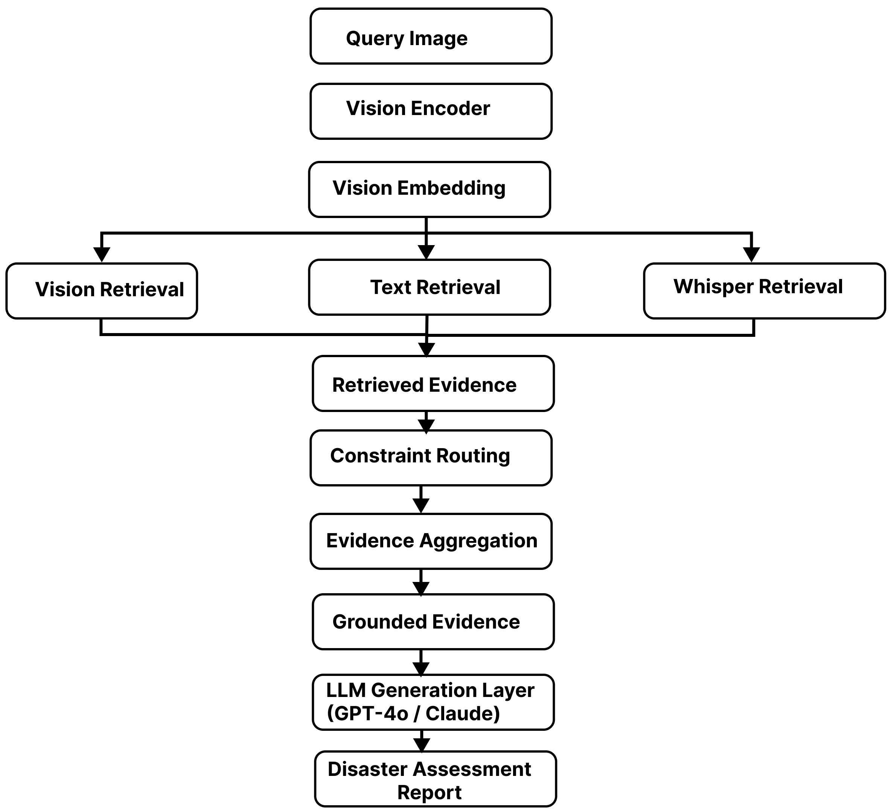
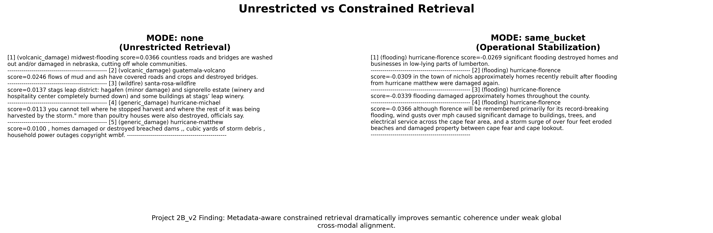

# Project 2B

Grounded Multimodal Retrieval & Evidence-Based Report Generation

<div align="center">

[]()
[]()
[]()
[]()
[]()
[]()
[]()

</div>

## Overview

Project 2B transforms the multimodal embedding space learned in Project 2A into an operational retrieval system for disaster-response intelligence.

Project 2A focused on learning a shared representation space across disaster imagery, textual reports, and audio-derived transcripts. While Project 2A focused on representation learning, Project 2B focuses on retrieval, grounding, evaluation, and operationalization of those learned representations. Project 2B operationalizes those learned representations through semantic retrieval, retrieval diagnostics, metadata-aware routing, evidence grounding, and report generation.

The system retrieves semantically relevant visual and textual evidence for a disaster query, applies retrieval constraints to improve coherence, aggregates grounded evidence, and generates evidence-based disaster assessment reports using GPT-4o or Claude.

Unlike traditional generative AI systems, the emphasis is on retrieval quality, retrieval interpretability, evidence provenance, and grounded generation rather than autonomous reasoning or agentic planning.

---

## Highlights

- Learned multimodal embedding space from Project 2A
- Built FAISS-based retrieval infrastructure
- Implemented metadata-aware retrieval routing
- Developed grounded multimodal evidence aggregation
- Generated evidence-based reports using GPT-4o and Claude
- Evaluated retrieval quality using Recall@K, MRR, and cross-event metrics

---

## Dataset

The project uses the xView2 disaster assessment dataset consisting of:

- Pre-disaster RGB imagery
- Post-disaster RGB imagery
- SAR imagery
- Disaster metadata
- External textual evidence
- Whisper-derived transcripts

Project 2B operates on the multimodal embeddings produced by Project 2A.

---

## Objectives

- Operationalize multimodal embeddings learned in Project 2A
- Build an end-to-end semantic retrieval system
- Evaluate retrieval quality across modalities
- Investigate metadata-aware retrieval stabilization
- Ground generated outputs using retrieved evidence
- Generate evidence-based disaster assessment reports

---

## System Architecture

### Figure 1. Project 2B System Architecture



**Figure 1.** End-to-end architecture of Project 2B. Multimodal embeddings produced in Project 2A are validated, indexed using FAISS, and queried through a retrieval engine. Retrieved visual, textual, and Whisper evidence is routed through metadata-aware constraints, aggregated into grounded evidence, and provided to an LLM for disaster assessment report generation.

---

## Retrieval Pipeline

### Figure 2. Retrieval Pipeline



**Figure 2.** Operational retrieval workflow for a query image. A vision embedding is generated and used to retrieve visual neighbors, textual evidence, and Whisper evidence. Retrieved evidence is filtered through metadata-aware constraints, aggregated into grounded evidence, and supplied to an LLM for report generation.

### Artifact Validation

All Project 2A artifacts are validated before retrieval begins.

Validation includes:

- Embedding integrity
- Metadata integrity
- L2-normalization verification
- NaN / Inf safety checks
- Index alignment verification

---

### Index Construction

FAISS indexes are built over the exported embedding corpora.

```text
Text Embeddings
        ↓
FAISS Index

Whisper Embeddings
        ↓
FAISS Index
```

Since all exported embeddings are L2-normalized:

```text
cosine_similarity(a,b)
        =
inner_product(a,b)
```

allowing efficient nearest-neighbor retrieval.

---

### Vision Retrieval

Vision retrieval searches the learned visual embedding manifold for semantically similar disaster patches.

Purpose:

- Visual semantic search
- Neighbor inspection
- Embedding manifold validation

---

### Cross-Modal Retrieval

Cross-modal retrieval uses a vision query to retrieve textual evidence.

Purpose:

- Vision-to-text semantic retrieval
- Alignment verification
- Evidence discovery

---

### Constraint-Based Retrieval

Metadata-aware retrieval constraints are applied before ranking.

Purpose:

- Improve retrieval coherence
- Reduce semantic drift
- Improve interpretability

---

### Grounded Retrieval

Retrieved visual and textual evidence are aggregated into a grounded evidence package.

Purpose:

- Evidence aggregation
- Retrieval provenance
- LLM-ready grounding

---

## Retrieval Policies

### MODE: none

Unrestricted retrieval.

All candidates remain eligible.

Used primarily for baseline retrieval and diagnostics.

---

### MODE: same_bucket

Restricts retrieval to the same disaster category.

Example:

```text
flooding
    →
flooding
```

This became the strongest operational retrieval policy.

---

### MODE: disaster_family

Allows retrieval among related disaster events.

Example:

```text
hurricane-florence
    →
hurricane-harvey
```

Used to balance diversity and relevance.

---

### MODE: same_event

Restricts retrieval to the originating disaster event.

Example:

```text
hurricane-florence
    →
hurricane-florence
```

Provides maximum event consistency.

---

## Quantitative Results

### Vision → Vision Retrieval

| Metric | Value |
|----------|----------|
| same_bucket_ratio | 0.9790 |
| same_event_ratio | 0.7726 |


**Observation**

The visual embedding manifold exhibits strong semantic organization and event clustering.

---

### Vision → Text Retrieval

| Metric | Value |
|----------|----------|
| same_bucket_ratio | 0.0153 |
| same_event_ratio | 0.0625 |

**Observation**

Cross-modal retrieval remains substantially more difficult than visual retrieval.

---

### Retrieval Evaluation

| Metric | Value |
|----------|----------|
| Recall@1 | 0.0000 |
| Recall@5 | 0.0648 |
| MRR | 0.0153 |
| XE Recall@5 | 0.0173 |

---

## Key Findings

### Finding 1

Vision embeddings learned meaningful disaster semantics.

Evidence:

```text
same_bucket_ratio ≈ 0.9790
```

indicating strong semantic clustering within the visual embedding space.

---

### Finding 2

Cross-modal retrieval remained substantially harder.

Evidence:

```text
same_bucket_ratio ≈ 0.0153
```

showing that vision-to-text retrieval remains a challenging problem despite shared embedding alignment.

---

### Finding 3

Metadata-aware retrieval improves retrieval stability.

The strongest operational retrieval strategy was:

```text
same_bucket retrieval
```

which balances:

- relevance
- diversity
- interpretability

---

### Finding 4

Grounding improves report reliability.

Retrieval evidence provides explicit support for generated conclusions and reduces unsupported claims.

---

## Grounded Report Generation

Project 2B extends retrieval into evidence-based report generation.

```text
Retrieved Evidence
        ↓
Grounded Prompt
        ↓
GPT-4o / Claude
        ↓
Grounded Disaster Report
```

The retrieval pipeline remains independent of the language model.

Both GPT-4o and Claude consume the same grounded evidence package.

Example:

```text
Likely Disaster Type:
Hurricane-driven flooding

Observed Damage:
Infrastructure damage,
housing destruction,
agricultural losses

Operational Implications:
Access disruption,
community isolation,
extended recovery needs
```

---

## Visualizations

### Vision Neighbor Retrieval


**Figure 3. Vision embedding retrieval.**  
A flooding-related query from Hurricane Michael retrieves semantically similar disaster imagery from the learned visual embedding space without any retrieval constraints. The retrieved neighbors exhibit strong cross-scene consistency despite originating from different geographic regions, demonstrating that the encoder learned a coherent disaster-aware visual embedding manifold.

---

### Grounded Multimodal Retrieval


**Figure 4. Grounded multimodal retrieval.**  
A structural-damage query from the Mexico Earthquake event retrieves bucket-consistent visual neighbors and textual evidence. The retrieved evidence is used to generate an operational summary, illustrating how multimodal retrieval can support grounded disaster assessment and situational understanding.

---

### Constraint-Based Retrieval Comparison



**Figure 5. Constraint-based retrieval comparison.**  
Comparison of retrieval behavior under unrestricted and bucket-aware retrieval policies. Unrestricted retrieval emphasizes semantic similarity, while metadata-aware bucket constraints improve retrieval coherence and operational stability without modifying the underlying embedding space. This demonstrates how retrieval policies can adapt the same learned embedding space for both exploratory analysis and production-oriented disaster response.

---

## Repository Structure

```text
2B/

├── scripts/
│   ├── retrieval/
│   ├── visualization/
│   └── llm/
│
├── indexes/
│
├── results/
│   ├── retrieval_metrics.json
│   └── llm_reports/
│
├── assets/
│   ├── system_architecture.png
│   ├── retrieval_pipeline.png
│   ├── vision_neighbors_q250.png
│   ├── grounded_retrieval_same_bucket_q350.png
│   └── constraint_comparison.png
│
└── README.md
```

---

## Usage

### Build Retrieval Indexes

```bash
PYTHONPATH=2B python \
2B/scripts/retrieval/build_faiss_indexes.py
```

### Vision Retrieval

```bash
PYTHONPATH=2B python \
2B/scripts/retrieval/retrieve_topk_vision.py \
    --query_idx 100
```

### Constraint-Based Retrieval

```bash
PYTHONPATH=2B python \
2B/scripts/retrieval/retrieve_constrained.py \
    --query_idx 100 \
    --constraint same_bucket
```

### Grounded Retrieval

```bash
PYTHONPATH=2B python \
2B/scripts/retrieval/grounded_multimodal_summary.py \
    --query_idx 100
```

### Grounded Report Generation

```bash
PYTHONPATH=2B python \
2B/scripts/llm/generate_grounded_report.py \
    --provider openai \
    --query_idx 100
```

```bash
PYTHONPATH=2B python \
2B/scripts/llm/generate_grounded_report.py \
    --provider anthropic \
    --query_idx 100
```

---

## Technologies

- Python
- PyTorch
- NumPy
- FAISS
- OpenAI GPT-4o
- Anthropic Claude Sonnet
- Contrastive Representation Learning
- Dense Vector Retrieval
- FAISS Vector Search
- Multimodal Retrieval
- Semantic Search
- Retrieval-Augmented Generation (RAG)
- Grounded AI Systems

---

## Future Work

- Larger textual evidence corpora
- Cross-modal reranking
- Cross-encoder reranking
- Retrieval confidence calibration
- Real-time disaster monitoring
- Streaming disaster-event ingestion
- Geospatial retrieval integration
- Decision-support systems for emergency response

---

## Project Positioning

This project demonstrates multimodal retrieval systems engineering, dense embedding search, retrieval-augmented generation (RAG), grounded AI, and evidence-based report generation for disaster-response applications.

The project is representative of workflows commonly found in:

- Applied AI Systems
- Multimodal AI Engineering
- Retrieval Engineering
- Search & Ranking Systems
- RAG Infrastructure
- Foundation Model Applications
- Disaster Intelligence Systems